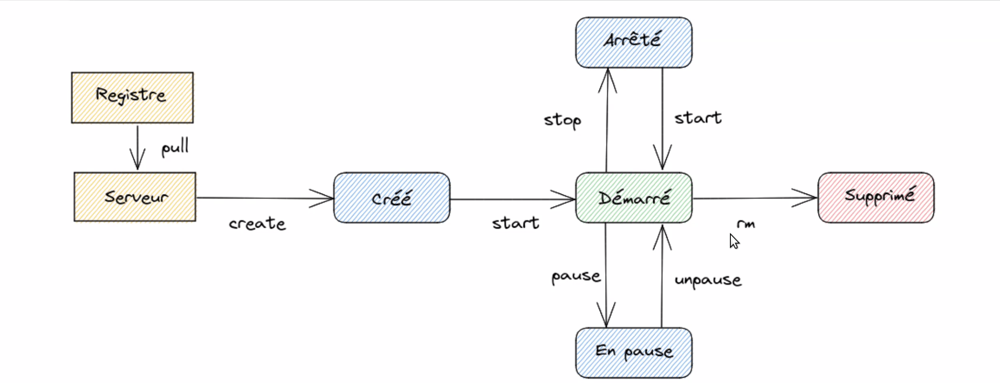

# Docker CheatSheet

## Qu'est ce que c'est ?

Docker est un système d'exploitation (ou environnement d'exécution) pour conteneurs.
Docker Engine est installé sur chacun des serveurs sur lesquels vous souhaitez exécuter des conteneurs.
Il vous fournit un ensemble de commandes simples pour concevoir, démarrer ou arrêter des conteneurs.

- Une technologie de conteneurisation => Isoler une zone du système sur lequel on va faire tourner une application.
- Une communauté très riche
- Une entreprise => Abonnement, offres payantes,...
- Open source, ecrit en `Go`

Docker permet de :
- Empaqueter les applications : Dans des boites ou des **images** avec leurs *dépendances*
- Les stocker : Stocker dans un registre qu'on pourra ensuite consommer
- Les livrer : Mettre à disposition cette **image**
- Les executer

## Liens docker

- (DockerHub)[https://hub.docker.com/]

## Differences VM vs Docker

- Docker :
    - Plus rapide à démarrer
    - Ne consomme que ce qui est nécéssaire
    - Pas d'OS à maintenir
    - Plus compact
- VM
    - Meilleur isolation
    - Emulation du matériel
    - Possibilité d'utiliser un OS différent

---

> Image => Classe
> Conteneur => Instanciation de cette classe

## Contenu d'une image docker

- Fichier recette => Système de fichiers contenant les paquets et applications installées
- Ensemble de couches comportant des instructions chainées
- Une image est *inerte*, rien n'est en cours d'éxécution
- Il est possible de partir d'une image déjà existante
- Possibilité d'ignorer des fichiers à copier => `.dockerignore`

---

## Les conteneurs

- Peut être vu comme l'instanciation d'une image
- Le conteneur fait tourner l'application par les instructions `ENTRYPOINT` et/ou `CMD`
- Ils peuvent durer de quelques seconde à plusieurs années

### Il est possible de =>
- Limiter les ressources affectées aux conteneurs
- Gérer la persistance des données
- Permettre la connectivité à un ou plusieurs réseaux
- Se connecter dans un conteneur pour éxéctuer des commandes
- Copier des fichiers dans ou depuis un conteneur
- Démarrer un conteneur juste le temps de lancer une commande

### Cycle de vie d'un container

